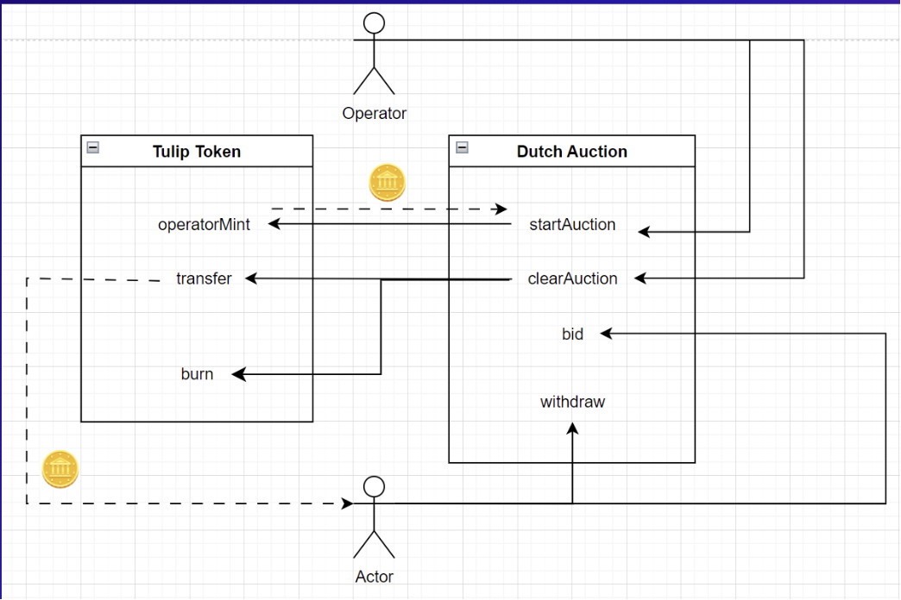

# Dutch Auction Demo

This is repo contains contracts implementations for Team Tulip (Group ...).

Contracts have been deployed to Sepolia testnet:

+ `DutchAuction`: [0x7Af467D962eFc7a6D3a107DE2CcE6c9312f1f884](https://sepolia.etherscan.io/address/0x7Af467D962eFc7a6D3a107DE2CcE6c9312f1f884)

+ `TulipToken`: [0x6252cf1805c19F53578a3F47AC4D8AE9398701dc](https://sepolia.etherscan.io/address/0x6252cf1805c19F53578a3F47AC4D8AE9398701dc)

Deployer: [0x79c5bb4045c756bdb53c6079fac54c288f66ca6b](https://sepolia.etherscan.io/address/0x79c5bb4045c756bdb53c6079fac54c288f66ca6b)

## Features

+ **Reusable** [✅]: A single `DutchAuction` contract can initiate multiple auction from `IAuctionableToken` compliant tokens. Dutch auction contract can conduct multiple auctions on the same or different types of token, given total auction supply and pricing curve.

+ **Composable** [✅]: Auction token and Auction contract are separated, each can be extended with arbitrary logic.

+ **Resilience** [✅]: Contract is robust against re-entrancy attack. Manipulating states before external payable calls. Utilizing Reentrancy Guard, with consideration of Transient storage [EIP-1153] to improve efficiency. NOT PUBLICLY AUDITED YET, USE AT YOUR OWN RISK!

+ **Gas Efficient** [✅]: Try running gas profile to see result (**@see** `Local Instruction / Run tasks / Test`)

    + `bid()` consumes about _**95k gas**_.

    + `startAuction()` consumes about _**300k gas**_.

    + `clearAuction()` consumes about _**25k gas / participant**_.

+ **Additional features: [✅]**
    + Auction operator can set a commitment amount limit per bidder, preventing a single actor from harvesting all the auctioned token.
    + If the auction has not been cleared 10 minutes after it expired, successful bidders are allowed to withdraw their committed ethers.

## Design considerations

In order to satisfy all requirements given in the problem statement, we have design the 2 contracts as follows:

1. We take `block.timestamp` as the "clock" for all time sensitive functions. Since the Shanghai upgrade to PoS, 
Ethereum consensus have encoded [12 seconds block time into the core protocol](https://github.com/ethereum/consensus-specs/blob/dev/specs/phase0/beacon-chain.md#time-parameters-1)
Therefore, `block.timestamp` serve as a consistent measure for our purposes.

2. Given 20 minutes auction, we expect it to be 100 blocks. The pricing curve decreases every minutes or roughly 5 blocks.

3. Dutch Auction contract has operator status on the auctioned token (comply with `IAuctionableToken` interfaces). During each auction period,
Dutch Auction contract will mint an `initialTokenSupply` of the auctioned token.

4. Each bidder have a limit for total wei committed in each auction. They have to committed wei during auction period, 
which is determined as `block.timestamp` since `auctionStart` until either 20 minutes have passed or the total committed amount of all bidders
have exceeded total auction supply. During settlement, the bidder can't get more tokens that this specified limit 
(shown in Demo Case 1, and Case 2).

5. Dutch Auction requires an operator (EOA/contract) to `startAuction` and `clearAuction`. 
In case auction have expired for at least 10 minutes and operator failed to call `clearAuction`, 
bidders are allowed to withdraw their commited ethers.
The token supply allocated to these bidders will be burned (shown in Demo Case 2).

## Flowchart

This flow chart shows operator and user interacction with the smart contracts.




## Mock scenario shown in our video demo

Tulip Token:
+ maxSupply: 10000

**Case 1: Auction is not sold out**

+ duration = 20 minutes
+ totalSupply = 100
+ startPrice = 2e15 (0.002 ETH) [0.2ETH to sold out immediately]
+ reservePrice = 1e15 (0.001 ETH)
+ 10% => maxWei = 0.01 ETH (reservePrice * totalSupply * 10%).

**Flow**

1. Bidder 1: Bid 0.002 ETH at start of auction

2. Bidder 2: Bid 0.002 ETH at 5 minutes

3. Bidder 2: Bid 0.05 ETH at 7 minutes. Refund happens (aka, only 0.008 ETH deducted instead of 0.05 ETH) because limit is set to 0.1 ETH.

4. After 20 minutes, clearAuciton
5. Show tokens are distributed to the bidders

    => Bidder 1: 2 tokens

    => Bidder 2: 10 tokens

**Case 2: Auction is sold out**

+ duration = 20 minutes
+ totalSupply = 100
+ startPrice = 2e15 (0.002 ETH) [0.2ETH to sold out immediately]
+ reservePrice = 1e15 (0.001 ETH)
+ 10000% => maxWei = 10 ETH (reservePrice * totalSupply * 10000%).

**Flow**

1. Bidder 1: Bid 0.002 ETH at start of auction

2. Bidder 2: Bid 0.3 ETH at 2 minutes

3. Wait 10 minutes, Bidder 1 withdraw -> Gets back his 0.002 ETH

4. Clear Auction

5. Bidder 2: get all 100 tokens and get some ETH back

## Repo structure

### 'src/' 

Dutch Auction and Auction Token implementations

+ **'src/interfacs'**: 

    - `IAuctionableToken.sol`: Token compliance standard for dutch auction

    - `IDutchAuction.sol`: Auction interface

+ **'src/lib'**: 

    - `WadMath.sol`: Minimal library for 18 fixed-point arithmetics.

    - `Errors.sol`: Custom errors for DutchAuction and Token contract

    - `ReentrancyGuard.sol`: Forked version of Openzeppelin's reentrancy guard 


+ **'src/*'**: core contracts

### 'test/' 

Contains the test scripts with matching source name.

### 'script/' 

Contains the scripts to deploy Tokens and Dutch Auction Contracts, and to run startAuction, clearAuction and withdraw

## Test coverage

```
src
├── interfaces
│   ├── IAuctionableToken.sol [N/A]
│   ├── IDutchAuction.ts [N/A]
├── lib
│   ├── Errors.sol [N/A]
│   ├── ReentrancyGuard.sol [✓ by Openzeppelin]
│   └── WadMath.sol [✓ by solmate]
├── DutchAuction.sol [✓]
├── ReentrancyAttackOnBid.ts [✓]
└── TulipToken.ts [✓]
```

## Local Instruction

### 1. Install foundry tool chains.

Follow instructions at (https://book.getfoundry.sh/getting-started/installation)[https://book.getfoundry.sh/getting-started/installation]

### 2. Run tasks

#### Compile 

```
forge compile
```

=> Check `./out` folder.

#### Test

```
forge test
```

With gas report 

```
forge test --gas-report
```

For specific contract

```
forge test --mc <CONTRACT_TO_MATCH>
```

#### Run scripts

The script require owner key to be stored in `.env` or directly input from [`forge script`](https://book.getfoundry.sh/reference/forge/forge-script#wallet-options---raw)

Operator can deploy contracts and run `startAuction/clearAuction` using ready made script found in `script/` folder.

We hardcoded our demo results in the 2 scenario in the scripts.

Details can be viewed in `script` folder.

